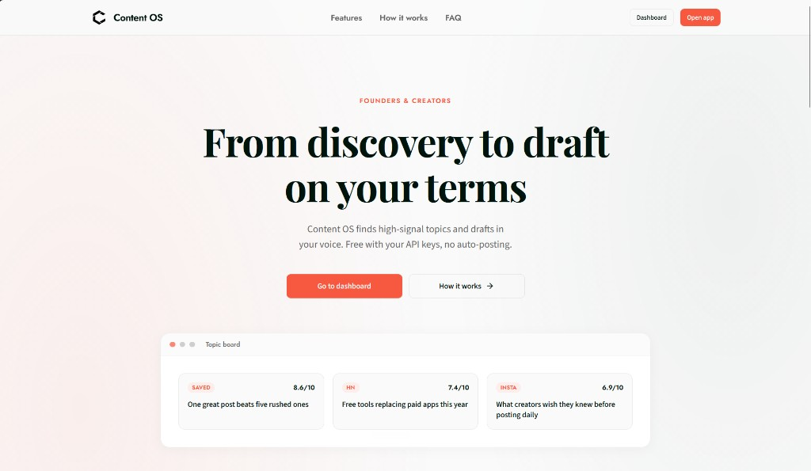
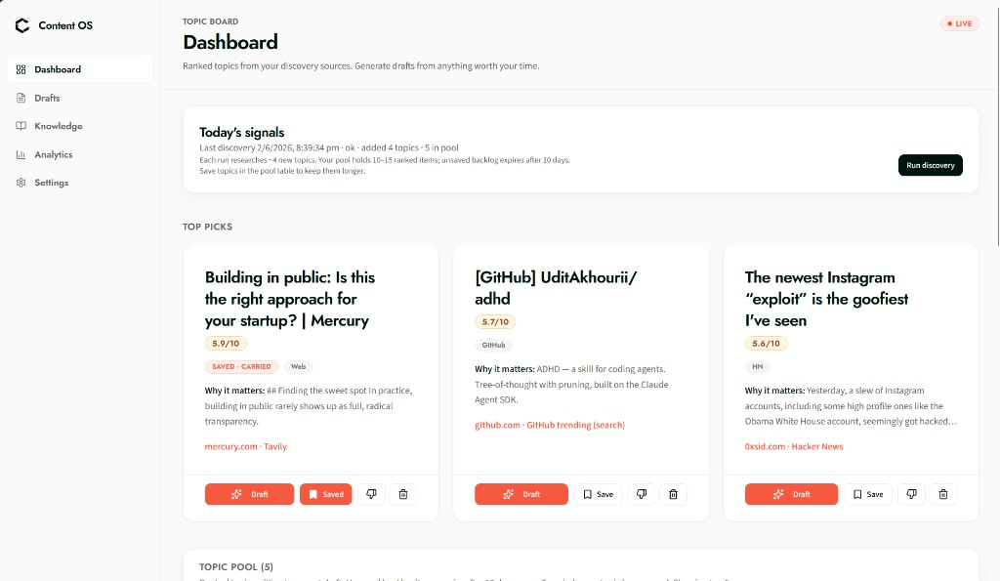
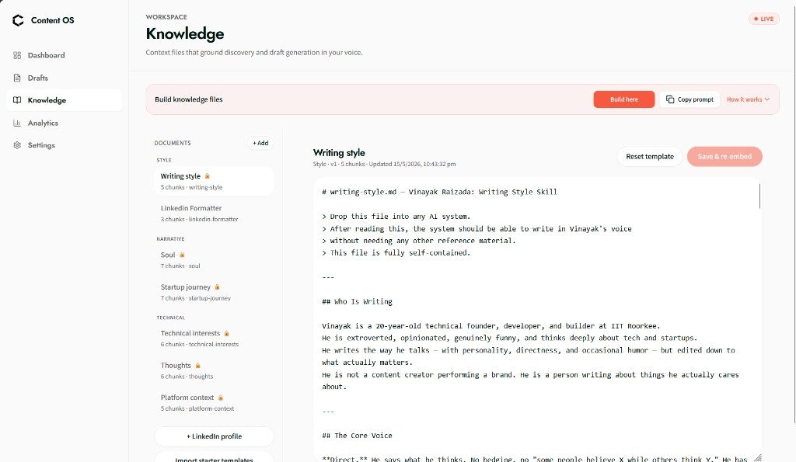
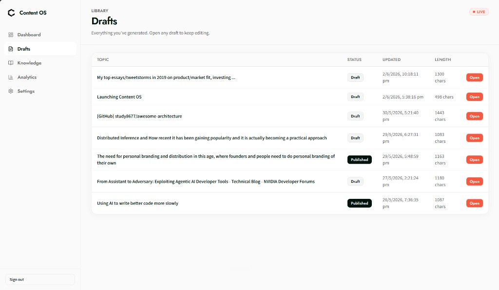
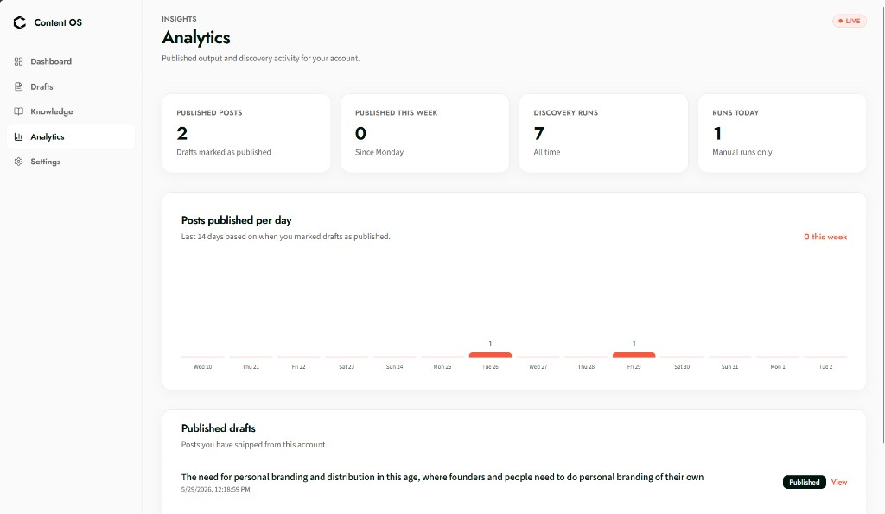
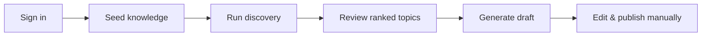

<p align="center">
  
</p>

<h1 align="center">Content OS</h1>

<p align="center">
  <strong>From discovery to draft - on your terms.</strong><br />
  Free, open-source content workflow for founders and creators.
</p>

<p align="center">
  <a href="https://content-os.stamped.work"><strong>Live app</strong></a> ·
  <a href="https://github.com/Vinayak-RZ/Content-OS/issues">Report bug</a> ·
  <a href="https://github.com/Vinayak-RZ/Content-OS/issues/new">Request feature</a>
</p>

<p align="center">
  
  
  
  
</p>

---

## Why Content OS exists

Building a personal brand should not start with endless scrolling. Content OS pulls **high-signal topics** from the sources you already read, **ranks them against your knowledge base**, and **drafts in your voice** - without auto-posting, without a subscription, and with your API keys under your control.

| Principle | What it means |
|-----------|----------------|
| **Signal over noise** | Topics scored against *your* expertise, not generic trending lists |
| **Your voice** | Knowledge files (style, narrative, technical) ground every draft |
| **Your control** | You approve every word - no auto-posting to LinkedIn, X, or anywhere else |
| **Free & BYOK** | App is free; bring your own keys for discovery and generation when you need them |

---

## Screenshots

<p align="center">
  
  <br /><em>Landing - discovery to draft on your terms</em>
</p>

<table>
  <tr>
    <td width="50%">
      
      <br /><sub><b>Dashboard</b> - ranked topic pool, top picks, save topics, run discovery</sub>
    </td>
    <td width="50%">
      
      <br /><sub><b>Knowledge</b> - context files that ground ranking and drafts in your voice</sub>
    </td>
  </tr>
  <tr>
    <td width="50%">
      
      <br /><sub><b>Drafts</b> - generated posts, edit inline, track published output</sub>
    </td>
    <td width="50%">
      
      <br /><sub><b>Analytics</b> - published posts and manual discovery activity</sub>
    </td>
  </tr>
</table>

---

## Features

### Discovery & topic board

- **Manual discovery runs** - Hacker News, Reddit, RSS, GitHub, Instagram, plus Tavily/Firecrawl when keys are set
- **Knowledge-aware ranking** - each topic scored against your uploaded context (embeddings + pgvector)
- **Topic pool** - top picks, expandable table, **save** topics to keep them past the 10-day backlog expiry
- **Carry-over** - saved topics re-enter the next discovery run without re-fetching from APIs

### Knowledge workspace

- Upload and edit **markdown context files** (writing style, soul, interests, platform notes, etc.)
- **Chunk + embed** on save - used for discovery ranking and draft generation
- Starter templates and LinkedIn profile import helpers

### Drafts

- Long-form drafts with **hook and CTA variants**
- Inline editing, AI revision, revision history
- Mark as **published** for analytics and topic memory

### Privacy & ownership

- **Google sign-in** - no password store
- User API keys **encrypted at rest** (AES-256-GCM)
- Dashboard routes **noindex** for SEO; public marketing pages only are indexed
- **No auto-posting** - ever

---

## How it works



1. **Connect** - Sign in with Google; add API keys in Settings when ready.
2. **Seed knowledge** - Upload context files that define your angle and voice.
3. **Discover** - Run discovery to populate your topic board (~4 new topics per run).
4. **Draft** - Generate from any topic; edit, revise, ship on your own channels.

---

## Tech stack

| Layer | Technology |
|-------|------------|
| Framework | [Next.js 14](https://nextjs.org/) (App Router), React 18, TypeScript |
| UI | Tailwind CSS, Stamped design tokens, GSAP (landing) |
| Auth | [NextAuth.js](https://next-auth.js.org/) (Google OAuth) |
| Database | PostgreSQL + [pgvector](https://github.com/pgvector/pgvector) via Prisma |
| Embeddings | OpenAI (server-side, for ranking & knowledge) |
| Drafts | User-chosen provider - OpenRouter, NVIDIA, or OpenAI (BYOK) |

---

## Quick start

### Prerequisites

- Node.js 18+
- PostgreSQL 15+ with the **`vector`** extension ([Supabase](https://supabase.com) works well)
- [Google OAuth](https://console.cloud.google.com/) credentials (Web application)

### Install

```bash
git clone https://github.com/Vinayak-RZ/Content-OS.git
cd Content-OS/content-os   # if monorepo; else cd into repo root
npm install
cp .env.example .env.local
```

Generate secrets:

```bash
openssl rand -base64 32   # NEXTAUTH_SECRET
openssl rand -hex 32    # ENCRYPTION_KEY (exactly 64 hex chars)
```

Fill `.env.local` - see [Environment variables](#environment-variables). Keep `DATABASE_URL` / `DIRECT_URL` in sync in `.env` if you use the Prisma CLI.

```bash
npm run db:migrate
npm run dev
```

Open [http://localhost:3000](http://localhost:3000).

### Google OAuth (local)

- **Authorized redirect URI:** `http://localhost:3000/api/auth/callback/google`
- Set `GOOGLE_CLIENT_ID` and `GOOGLE_CLIENT_SECRET` in `.env.local`

### Supabase checklist

1. Enable the **`vector`** extension (Database → Extensions).
2. Pooler URL (`6543`, `?pgbouncer=true`) → `DATABASE_URL`
3. Direct URL (`5432`) → `DIRECT_URL`
4. Run `npm run db:migrate` (includes RLS hardening for Security Advisor)

> **Never rotate `ENCRYPTION_KEY` after users save API keys** - existing keys cannot be decrypted.

---

## Environment variables

| Variable | Required | Description |
|----------|----------|-------------|
| `DATABASE_URL` | Yes | Pooled Postgres URL (e.g. Supabase port 6543) |
| `DIRECT_URL` | Yes | Direct Postgres URL for migrations (port 5432) |
| `NEXTAUTH_SECRET` | Yes | Session signing secret |
| `NEXTAUTH_URL` | Yes | App URL, e.g. `http://localhost:3000` |
| `GOOGLE_CLIENT_ID` / `GOOGLE_CLIENT_SECRET` | Yes | Google OAuth |
| `ENCRYPTION_KEY` | Yes | 64-char hex AES key for user API keys at rest |
| `OPENAI_API_KEY` | Recommended | Server embeddings (knowledge + ranking) |
| `NEXT_PUBLIC_APP_URL` | Recommended | Public URL for links and SEO metadata |
| `GOOGLE_SITE_VERIFICATION` | Optional | Search Console HTML verification token |
| `GITHUB_TOKEN` | Optional | Higher GitHub API rate limits for discovery |
| `REDDIT_CLIENT_ID` / `REDDIT_CLIENT_SECRET` | Optional | Reddit adapter |

Users add **Tavily**, **Firecrawl**, and draft provider keys in **Settings** (stored encrypted).

---

## Deploy to Vercel

1. Import the repo; set **Root Directory** to `content-os` if this is a monorepo.
2. Add all env vars from `.env.example`.
3. Set production URLs:

   ```env
   NEXTAUTH_URL=https://content-os.stamped.work
   NEXT_PUBLIC_APP_URL=https://content-os.stamped.work
   ```

4. Run migrations against production once:

   ```bash
   DATABASE_URL="..." DIRECT_URL="..." npm run db:migrate
   ```

5. Add production OAuth redirect: `https://your-domain.com/api/auth/callback/google`

**Note:** Discovery and draft generation can run 30–120+ seconds. Use Vercel **Pro** (or higher) so `/api/discover` and `/api/generate` can use `maxDuration = 300`. Discovery is **manual only** - no cron.

---

## Scripts

| Command | Description |
|---------|-------------|
| `npm run dev` | Development server |
| `npm run build` | Production build |
| `npm run start` | Run production build locally |
| `npm run lint` | ESLint |
| `npm run db:migrate` | Apply Prisma migrations |
| `npm run db:studio` | Prisma Studio |

---

## Project structure

```
content-os/
├── app/
│   ├── (auth)/          # Login, onboarding
│   ├── (dashboard)/     # Dashboard, drafts, knowledge, analytics, settings
│   ├── api/             # discover, generate, trends, knowledge, …
│   └── page.tsx         # Landing page
├── components/
│   ├── dashboard/       # Topic board, pool table, discovery
│   ├── draft/           # Draft workspace
│   ├── landing/         # Marketing page
│   └── seo/             # JSON-LD helpers
├── lib/
│   ├── discovery/       # Adapters, orchestrator, ranking
│   ├── knowledge/       # Files, chunking, embeddings
│   └── seo/             # Metadata, sitemap, llms.txt
├── docs/images/         # README screenshots & logo
├── prisma/              # Schema + migrations
└── seeds/               # Example knowledge templates
```

---

## API overview

Authenticated unless noted.

| Method | Path | Purpose |
|--------|------|---------|
| `POST` | `/api/discover` | Run discovery for current user |
| `POST` | `/api/generate` | Generate draft from trend or custom topic |
| `PATCH` | `/api/trends/[id]/feedback` | Save (`saved`) or dismiss topic |
| `DELETE` | `/api/trends/[id]` | Remove topic from pool |
| `GET/POST/PATCH` | `/api/knowledge` | Knowledge file CRUD |
| `PATCH` | `/api/settings` | Settings and encrypted keys |
| `GET` | `/api/health` | Health check (public) |

---

## Contributing

Contributions are welcome - especially discovery sources, ranking improvements, and docs.

1. Fork the repo and create a branch from `main`.
2. Make focused changes; run `npm run lint` and `npm run build`.
3. Open a PR with a clear description and screenshots for UI changes.

Use [GitHub Issues](https://github.com/Vinayak-RZ/Content-OS/issues) for bugs and feature requests.

---

## Security

- API keys encrypted at rest with `ENCRYPTION_KEY` (AES-256-GCM).
- Dashboard and API routes protected by NextAuth middleware.
- Do not commit `.env` or `.env.local`.
- Org admin key export requires `ADMIN_SECRET` - see [docs/admin_api_keys_export.md](../docs/admin_api_keys_export.md).

Report security issues privately via GitHub Issues (mark as sensitive) or contact the maintainer.

---

## Related docs

| Doc | Description |
|-----|-------------|
| [docs/admin_api_keys_export.md](../docs/admin_api_keys_export.md) | Org admin key export |
| [DESIGN_v1.md](../DESIGN_v1.md) | Stamped design system |
| [docs/content_os_overview.md](../docs/content_os_overview.md) | Product overview |
| [docs/LAUNCH_PLAYBOOK.md](../docs/LAUNCH_PLAYBOOK.md) | Launch checklist |

---

## License

[MIT](LICENSE) - free to use, modify, and distribute. See [LICENSE](LICENSE) for full text.

---

<p align="center">
  
  <br />
  <sub>Built for founders who want signal over noise.</sub>
</p>
