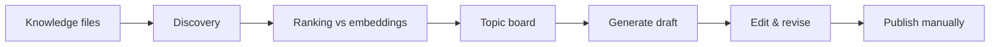
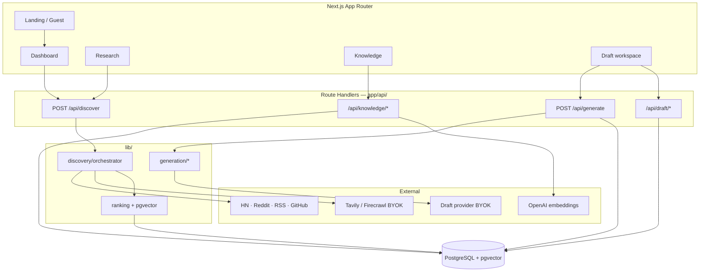
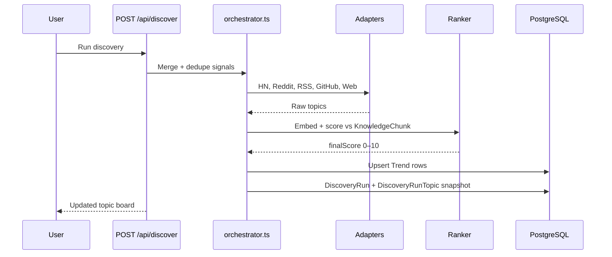

<p align="center">
  
</p>

<h1 align="center">Content OS</h1>

<p align="center">
  <strong>From discovery to draft — on your terms.</strong><br />
  Free personal-brand workflow for founders and creators.
</p>

<p align="center">
  <a href="https://content-os.stamped.work"><strong>Live app</strong></a> ·
  <a href="https://github.com/Vinayak-RZ/Content-OS/issues">Report bug</a> ·
  <a href="https://github.com/Vinayak-RZ/Content-OS/issues/new">Request feature</a>
</p>

<p align="center">
  
  
  
  
</p>

> **What it is:** A personal content operating system — discover high-signal topics, rank them against your knowledge, draft in your voice, publish manually.  
> **What it is not:** An AI writing tool, auto-poster, or subscription SaaS.  
> **Primary interface:** [https://content-os.stamped.work](https://content-os.stamped.work) (web app, Google sign-in or guest preview).

---

## TL;DR

- **Free & BYOK** — no subscription; users bring OpenRouter, NVIDIA, OpenAI, Tavily, Firecrawl keys (encrypted at rest)
- **Signal over noise** — topics scored 0–10 against *your* knowledge embeddings (pgvector), not generic trending lists
- **Manual discovery** — HN, Reddit, RSS, GitHub, optional web search; no cron, user clicks Run discovery
- **Knowledge workspace** — markdown context files, AI builder, chunk + embed on save
- **Drafts** — generate from topics; version history with restore; X thread from LinkedIn draft; delete + published archive
- **Research history** — every authenticated discovery run persisted at `/research`
- **Guest mode** — try dashboard without sign-in (3 discoveries/day, no DB persistence)
- **No auto-posting** — you approve every word on your own channels
- **Stack:** Next.js 14 App Router · Prisma · PostgreSQL + pgvector · NextAuth (Google)
- **API surface:** 20 route files · **Data model:** 10 Prisma models · **App pages:** 11 routes
- **Deploy:** Vercel (Pro recommended for 300s API timeout) · Supabase Postgres with `vector` extension
- **Tests:** no automated suite — manual smoke via `npm run build` and route checks

---

## Table of contents

1. [Vision](#1-vision)
2. [Screenshots](#2-screenshots)
3. [Architecture](#3-architecture)
4. [Quick start](#4-quick-start)
5. [Configuration](#5-configuration)
6. [App routes & navigation](#6-app-routes--navigation)
7. [Features by area](#7-features-by-area)
8. [API catalog](#8-api-catalog)
9. [Data model](#9-data-model)
10. [Project structure](#10-project-structure)
11. [Scripts & CLI](#11-scripts--cli)
12. [Deployment](#12-deployment)
13. [Testing & quality](#13-testing--quality)
14. [Security](#14-security)
15. [Roadmap & changelog](#15-roadmap--changelog)
16. [Contributing & license](#16-contributing--license)
17. [FAQ & glossary](#17-faq--glossary)

---

## 1. Vision

### 1.1 Problem

Building a personal brand should not start with endless scrolling. Most founders and creators hit the same wall: hours in HN/Reddit feeds, blank-page paralysis, and AI drafts that sound nothing like them.

### 1.2 Solution

Content OS compresses discovery → ranking → drafting into one loop **grounded in your knowledge and voice**:



### 1.3 What it is / is not

| It is | It is not |
|-------|-----------|
| Personal content OS (discovery → draft → you publish) | Generic ChatGPT wrapper |
| Ranked signal against *your* expertise | Trend spam / volume play |
| Free app with BYOK API keys | Subscription product |
| Manual publishing on your channels | Auto-poster to LinkedIn or X |
| Guest preview for evaluation | Full anonymous persistence |

### 1.4 Principles

| Principle | Meaning |
|-----------|---------|
| **Signal over noise** | Topics scored against your knowledge, not loudest feed |
| **Your voice** | Writing style, soul, interests files ground every draft |
| **Your control** | No auto-posting — ever |
| **Free & BYOK** | App is free; reasonable usage fits free API tiers |

**One-liner:** *Find what's worth saying, draft it in your voice, publish on your terms.*

---

## 2. Screenshots

<p align="center">
  
  <br /><em>Landing — discovery to draft on your terms</em>
</p>

<table>
  <tr>
    <td width="50%">
      
      <br /><sub><b>Dashboard</b> — ranked topic pool, top picks, run discovery</sub>
    </td>
    <td width="50%">
      
      <br /><sub><b>Knowledge</b> — context files for ranking and drafts</sub>
    </td>
  </tr>
  <tr>
    <td width="50%">
      
      <br /><sub><b>Drafts</b> — generated posts, edit, published archive</sub>
    </td>
    <td width="50%">
      
      <br /><sub><b>Analytics</b> — published posts and discovery activity</sub>
    </td>
  </tr>
</table>

---

## 3. Architecture

### 3.1 System overview



### 3.2 Discovery run lifecycle



### 3.3 Auth modes

| Mode | Entry | DB writes | Discovery |
|------|-------|-----------|-----------|
| **Google user** | `/login` OAuth | Full | `POST /api/discover` |
| **Guest** | `GET /api/guest/enter` | None | `POST /api/discover/guest` — 3/day, sessionStorage |
| **Sign-in** | Clears guest cookie | Migrates to user session | — |

Middleware protects `/dashboard`, `/drafts`, `/draft/`, `/knowledge`, `/settings`, `/onboarding`, `/analytics`, `/activity`. Pages enforce access via `getAppAccess()`.

### 3.4 Tech stack

| Layer | Technology |
|-------|------------|
| Framework | [Next.js 14.2](https://nextjs.org/) App Router, React 18, TypeScript 5 |
| UI | Tailwind CSS, Stamped design tokens (`app/globals.css`), GSAP (landing) |
| Auth | [NextAuth.js 4](https://next-auth.js.org/) — Google OAuth |
| ORM | Prisma 5.22 |
| Database | PostgreSQL 15+ with [pgvector](https://github.com/pgvector/pgvector) |
| Embeddings | OpenAI (server-side, ranking + knowledge) |
| Drafts | User BYOK — OpenRouter, NVIDIA, or OpenAI |

---

## 4. Quick start

### 4.1 Prerequisites

- Node.js 18+
- PostgreSQL 15+ with **`vector`** extension ([Supabase](https://supabase.com) recommended)
- [Google OAuth](https://console.cloud.google.com/) Web application credentials

### 4.2 Install

```bash
git clone https://github.com/Vinayak-RZ/Content-OS.git
cd Content-OS
npm install
cp .env.example .env.local
```

Generate secrets:

```bash
openssl rand -base64 32   # NEXTAUTH_SECRET
openssl rand -hex 32      # ENCRYPTION_KEY — exactly 64 hex chars
```

Fill `.env.local` — see [§5 Configuration](#5-configuration). Keep `DATABASE_URL` and `DIRECT_URL` in `.env` too if you use Prisma CLI directly.

```bash
npm run db:migrate
npm run dev
```

Open [http://localhost:3000](http://localhost:3000).

### 4.3 Google OAuth (local)

| Setting | Value |
|---------|-------|
| Authorized redirect URI | `http://localhost:3000/api/auth/callback/google` |
| Env vars | `GOOGLE_CLIENT_ID`, `GOOGLE_CLIENT_SECRET` |

### 4.4 Supabase checklist

1. Enable **`vector`** extension (Database → Extensions).
2. Pooler URL port **6543** with `?pgbouncer=true` → `DATABASE_URL`
3. Direct URL port **5432** → `DIRECT_URL`
4. Run `npm run db:migrate`

> **Never rotate `ENCRYPTION_KEY` after users save API keys** — existing keys cannot be decrypted.

---

## 5. Configuration

All keys from `.env.example` (17 variables):

| Variable | Required | Description |
|----------|----------|-------------|
| `DATABASE_URL` | Yes | Pooled Postgres (Supabase port 6543) |
| `DIRECT_URL` | Yes | Direct Postgres for migrations (port 5432) |
| `NEXTAUTH_SECRET` | Yes | Session signing secret |
| `NEXTAUTH_URL` | Yes | App URL (`http://localhost:3000` or production) |
| `GOOGLE_CLIENT_ID` | Yes | Google OAuth |
| `GOOGLE_CLIENT_SECRET` | Yes | Google OAuth |
| `ENCRYPTION_KEY` | Yes | 64-char hex AES-256-GCM for user API keys |
| `OPENAI_API_KEY` | Recommended | Server embeddings (knowledge + ranking) |
| `NEXT_PUBLIC_APP_URL` | Recommended | Public URL for links and SEO |
| `GOOGLE_SITE_VERIFICATION` | Optional | Search Console HTML token |
| `GITHUB_TOKEN` | Optional | Higher GitHub API rate limits |
| `REDDIT_CLIENT_ID` / `REDDIT_CLIENT_SECRET` | Optional | Reddit adapter |
| `RESEND_API_KEY` / `RESEND_FROM_EMAIL` | Optional | Future email digest |
| `ADMIN_SECRET` | Optional | Org admin BYOK export (min 32 chars) |

**User-managed keys (Settings UI, encrypted):** Tavily, Firecrawl, OpenRouter, NVIDIA, OpenAI draft keys.

---

## 6. App routes & navigation

### 6.1 Pages (11)

| Route | File | Purpose |
|-------|------|---------|
| `/` | `app/page.tsx` | Marketing landing |
| `/login` | `app/(auth)/login/page.tsx` | Google sign-in |
| `/onboarding` | `app/(auth)/onboarding/page.tsx` | Persona + first-run setup |
| `/dashboard` | `app/(dashboard)/dashboard/page.tsx` | Topic board, run discovery |
| `/research` | `app/(dashboard)/research/page.tsx` | Discovery run history |
| `/drafts` | `app/(dashboard)/drafts/page.tsx` | Draft library + published archive |
| `/draft/[id]` | `app/(dashboard)/draft/[id]/page.tsx` | Draft workspace |
| `/knowledge` | `app/(dashboard)/knowledge/page.tsx` | Knowledge files |
| `/analytics` | `app/(dashboard)/analytics/page.tsx` | Published posts, activity |
| `/settings` | `app/(dashboard)/settings/page.tsx` | BYOK keys, preferences |
| `/activity` | `app/(dashboard)/activity/page.tsx` | Legacy activity (not in sidebar) |

### 6.2 Sidebar navigation

Dashboard · Research · Drafts · Knowledge · Analytics · Settings

---

## 7. Features by area

### 7.1 Discovery & topic board

- Manual runs only — **no cron**
- Adapters: Hacker News, Reddit, RSS, GitHub; Tavily/Firecrawl when user keys set
- Knowledge-aware ranking via `KnowledgeChunk` embeddings + pgvector similarity
- Top picks (3 cards), expandable topic pool, save/dismiss feedback
- 10-day backlog expiry; **saved** topics carry over to next run
- Each run creates `DiscoveryRun` + `DiscoveryRunTopic` snapshot

### 7.2 Guest mode

- `GET /api/guest/enter` sets HttpOnly cookie → demo dashboard
- `POST /api/discover/guest` — 3 runs/day, results in `sessionStorage` only
- Preview overlays on knowledge, drafts, analytics
- Sign in to persist data; guest cookie cleared on OAuth

### 7.3 Knowledge workspace

- Markdown files: writing style, soul, interests, custom files
- Roles: `style` | `narrative` | `technical` | `brand` | `general`
- Chunk + embed on save → `KnowledgeChunk` with vector column
- AI knowledge builder (`POST /api/knowledge/build`)
- Starter seeds (`POST /api/knowledge/seed`), URL scrape helper

### 7.4 Drafts

- Generate from trend or custom topic (`POST /api/generate`)
- Hook + CTA variants; inline edit
- **Revision history** — kinds: `initial`, `manual`, `ai_edit`, `restore`, `x_thread`; max 30 entries; restore via `PATCH /api/draft/[id]?restoreRevisionId=`
- **X thread** — `POST /api/draft/[id]/x-thread` generates 2–3 tweets from LinkedIn draft
- **Delete** — `DELETE /api/draft/[id]`
- **Published archive** — collapsible section in drafts library
- Status: `draft` | `published`; `publishedAt` for analytics

### 7.5 Privacy & SEO

- Google OAuth only — no password store
- User API keys AES-256-GCM encrypted (`lib/crypto.ts`)
- Dashboard routes `noindex`; public landing indexed
- JSON-LD, sitemap, `llms.txt` in `lib/seo/`

---

## 8. API catalog

**20 route files** under `app/api/`. Authenticated unless noted.

| Method | Path | Purpose |
|--------|------|---------|
| `GET` | `/api/health` | Health check (public) |
| `*` | `/api/auth/[...nextauth]` | NextAuth handlers |
| `GET` | `/api/guest/enter` | Start guest session → redirect `/dashboard` |
| `POST` | `/api/discover` | Run discovery (authenticated) |
| `POST` | `/api/discover/guest` | Guest discovery (rate-limited) |
| `POST` | `/api/generate` | Generate draft |
| `GET` | `/api/trends` | List user trends |
| `PATCH` | `/api/trends/[id]/feedback` | Save or dismiss topic |
| `DELETE` | `/api/trends/[id]` | Remove topic from pool |
| `GET` | `/api/topic-engagements` | Topic engagement records |
| `GET` | `/api/settings` | Read settings |
| `PATCH` | `/api/settings` | Update settings + encrypted keys |
| `GET` | `/api/knowledge` | List knowledge files |
| `POST` | `/api/knowledge` | Create knowledge file |
| `GET` / `PUT` / `DELETE` | `/api/knowledge/[slug]` | Single file CRUD |
| `POST` | `/api/knowledge/build` | AI knowledge builder |
| `POST` | `/api/knowledge/seed` | Seed starter templates |
| `POST` | `/api/scrape-url` | Scrape URL for import |
| `GET` / `PATCH` / `DELETE` | `/api/draft/[id]` | Draft CRUD, restore revision |
| `POST` | `/api/draft/[id]/edit` | AI revision (saves snapshot) |
| `POST` | `/api/draft/[id]/x-thread` | Generate X thread |
| `GET` | `/api/admin/export-keys` | Admin BYOK export (`ADMIN_SECRET`) |

Long-running: `/api/discover` and `/api/generate` use `maxDuration = 300` (see `vercel.json`).

---

## 9. Data model

**10 Prisma models** — `prisma/schema.prisma`

| Model | Purpose |
|-------|---------|
| `User` | Account, persona, encrypted BYOK keys, onboarding |
| `UsageCounter` | Rate limits (`generate_hour`, `discover_day`) |
| `Trend` | Discovered topic in user pool (scores, feedback, expiry) |
| `Draft` | Post content, hooks, CTAs, `revisionHistory` JSON, `xThreadParts` |
| `KnowledgeFile` | Markdown context file metadata + content |
| `KnowledgeChunk` | Chunked text + embedding vector |
| `TopicEngagement` | Save/dismiss/publish engagement |
| `CronLog` | Legacy discovery log rows |
| `DiscoveryRun` | Persisted discovery run metadata |
| `DiscoveryRunTopic` | Topic snapshot per run |

**7 migrations** in `prisma/migrations/` — apply with `npm run db:migrate`.

Key `Draft.revisionHistory` entry shape:

```json
{ "id": "uuid", "kind": "manual|ai_edit|restore|initial|x_thread", "contentBefore": "...", "createdAt": "ISO8601" }
```

---

## 10. Project structure

```
content-os/
├── app/
│   ├── (auth)/              # login, onboarding
│   ├── (dashboard)/         # dashboard, research, drafts, draft/[id], knowledge, analytics, settings, activity
│   ├── api/                 # 20 route handlers
│   ├── globals.css          # Design tokens (source of truth)
│   ├── layout.tsx
│   └── page.tsx             # Landing
├── components/
│   ├── dashboard/           # Topic board, pool table, discovery controls
│   ├── draft/               # Workspace, revision panel, X thread panel
│   ├── drafts/              # Library, published archive
│   ├── research/            # Discovery run history
│   ├── knowledge/           # File editor, AI builder
│   ├── landing/             # Marketing page (GSAP)
│   ├── guest/               # Guest preview overlays
│   └── seo/                 # JSON-LD, metadata helpers
├── lib/
│   ├── discovery/           # orchestrator.ts, adapters, persist-run.ts, ranking
│   ├── generation/          # Draft prompts, x-thread prompts/schema
│   ├── knowledge/           # Chunking, embeddings, builder
│   ├── drafts/              # revision.ts
│   ├── guest/               # demo-data.ts, guest access
│   ├── seo/                 # site-config, sitemap, llms files
│   └── crypto.ts            # AES-256-GCM for user keys
├── prisma/
│   ├── schema.prisma
│   └── migrations/
├── scripts/
│   ├── export-user-keys.mjs # Admin CLI
│   └── clean-prisma-artifacts.mjs
├── docs/images/             # README screenshots
├── seeds/founder/           # Example knowledge templates
├── middleware.ts            # Auth + guest cookie handling
├── vercel.json              # maxDuration for API routes
└── package.json
```

---

## 11. Scripts & CLI

| Command | Description |
|---------|-------------|
| `npm run dev` | Development server (port 3000) |
| `npm run build` | `prisma generate` + Next.js production build |
| `npm run start` | Run production build locally |
| `npm run lint` | ESLint (Next.js config) |
| `npm run db:migrate` | `prisma migrate deploy` |
| `npm run db:push` | `prisma db push` (dev only) |
| `npm run db:studio` | Prisma Studio GUI |
| `npm run db:generate` | Regenerate Prisma client |
| `npm run admin:export-keys` | Decrypt user BYOK keys (requires `ADMIN_SECRET`) |
| `npm run admin:export-keys:csv` | Same, CSV output |

---

## 12. Deployment

### 12.1 Vercel

1. Import [Content-OS](https://github.com/Vinayak-RZ/Content-OS) on Vercel.
2. Add all env vars from `.env.example`.
3. Production URLs:

   ```env
   NEXTAUTH_URL=https://content-os.stamped.work
   NEXT_PUBLIC_APP_URL=https://content-os.stamped.work
   ```

4. Run migrations once against production:

   ```bash
   DATABASE_URL="..." DIRECT_URL="..." npm run db:migrate
   ```

5. Google OAuth redirect: `https://content-os.stamped.work/api/auth/callback/google`

**Vercel Pro** (or higher) recommended — discovery and generation run 30–120+ seconds; `maxDuration = 300` in `vercel.json`.

### 12.2 Post-deploy smoke

- [ ] Landing loads at production URL
- [ ] Google sign-in completes
- [ ] Onboarding → knowledge seed → discovery → draft → publish flow
- [ ] `/research` shows run after discovery
- [ ] Guest enter works without auth

---

## 13. Testing & quality

| Check | Command |
|-------|---------|
| Lint | `npm run lint` |
| Production build | `npm run build` |
| Manual E2E | Dev server → full user flow |

**No automated test suite** (Jest/Vitest/Playwright) is configured. Validate changes with build + manual route checks before merging.

---

## 14. Security

- User API keys encrypted at rest with `ENCRYPTION_KEY` (AES-256-GCM) — `lib/crypto.ts`
- NextAuth session on all dashboard/API routes (guest cookie for preview mode)
- Never commit `.env` or `.env.local`
- Admin key export gated by `ADMIN_SECRET` — use `npm run admin:export-keys` or `GET /api/admin/export-keys`
- Dashboard `robots: noindex` — only marketing pages indexed

Report security issues via [GitHub Issues](https://github.com/Vinayak-RZ/Content-OS/issues) (mark sensitive).

---

## 15. Roadmap & changelog

### 15.1 Shipped (recent)

| Date | Change |
|------|--------|
| 2026-06-12 | Draft version history + restore; X thread from LinkedIn draft |
| 2026-06-12 | Draft delete; published archive in drafts library |
| 2026-06-12 | Research history page; `DiscoveryRun` persistence |
| 2026-06-03 | SEO/AEO improvements; footer social links; UI fixes |
| 2026-06-02 | Guest mode — try dashboard without sign-in |

### 15.2 Possible future directions

- Email digest via Resend (env vars already in `.env.example`)
- Additional discovery adapters
- Automated test suite for API and critical flows
- Embedded launch video on landing hero

---

## 16. Contributing & license

1. Fork and branch from `main`.
2. Run `npm run lint` and `npm run build`.
3. Open a PR with description and screenshots for UI changes.

[MIT](LICENSE) — Copyright 2026 Content OS contributors.

---

## 17. FAQ & glossary

### FAQ

**Is discovery automatic?**  
No. Click **Run discovery** on the dashboard. Cron was removed.

**Do I need paid APIs?**  
The app is free. Embeddings use server `OPENAI_API_KEY`; drafts and optional web search use your BYOK keys on free tiers for reasonable usage.

**Can guests save drafts?**  
No. Guest mode is preview-only. Sign in to persist.

**How long are topics kept?**  
Unsaved topics expire after ~10 days. Saved topics carry over.

### Glossary

| Term | Definition |
|------|------------|
| **BYOK** | Bring Your Own Keys — user API keys stored encrypted in `User` row |
| **Trend** | A discovered topic in the ranked pool |
| **finalScore** | 0–10 relevance score vs your knowledge embeddings |
| **DiscoveryRun** | One persisted execution of the discovery orchestrator |
| **Signal** | Topic that fits your expertise vs generic trending noise |

---

<p align="center">
  
  <br />
  <sub>Built for founders and creators who want signal over noise.</sub>
</p>
